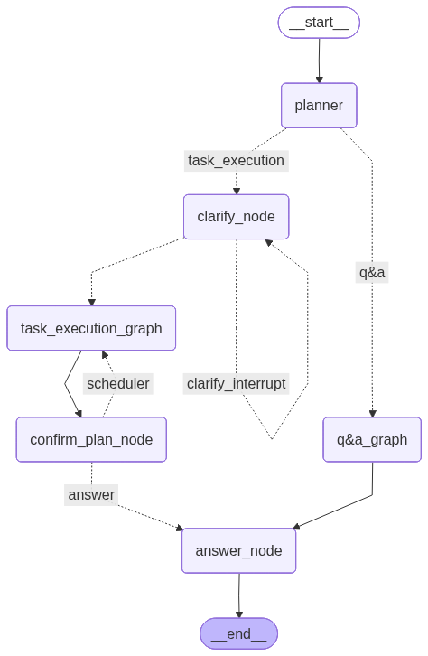

## Agentic Task Execution System (POC)

This project demonstrates an agentic AI system that can:

* Handle Q&A via Retrieval-Augmented Generation (RAG)
* Execute task-oriented requests (e.g. scheduling a supplier payment)
* Use clarification and human-in-the-loop mechanisms when information is missing

---

## Architecture Overview

The system is built as a **multi-agent, graph-based workflow** using LangGraph. User requests are first analyzed and routed, then processed through specialized agents depending on intent.

### High-level flow

1. **Planner Agent**
   Interprets the user request and decides whether it should be handled as a Q&A task or a task-execution request.

2. **Q&A Graph (RAG Path)**
   For informational questions, the request is routed to a retrieval-based Q&A pipeline that searches relevant knowledge and generates an answer.

3. **Clarify Agent (Task Execution Path)**
   For task-execution requests, the clarify agent checks whether all required information is available.

   * If information is missing, it triggers a **human-in-the-loop clarification interrupt**.
   * Clarification is bounded by a predefined budget to avoid infinite questioning.

4. **Scheduler Agent**
   Once sufficient information is available (or the clarification budget is exhausted), the scheduler generates a **high-level execution plan**. No real action is executed; the output is a structured plan only.

5. **Confirmation Step**
   The generated plan is presented to the user for confirmation. The user may approve the plan or request adjustments.

6. **Answer Node**
   Produces the final response, either as a direct answer (Q&A) or as a confirmed execution plan (task execution).

---

## System Diagram

The following diagram illustrates the overall agent workflow and control flow between nodes:




---

## Setup

### 1. Create virtual environment

```bash
python -m venv .venv
source .venv/bin/activate
```

### 2. Install dependencies

```bash
pip install -r requirements.txt
```

### 3. Configure environment variables

```bash
cp .env.example .env
# then edit .env and add your API key: API_KEY = ''
```

---

## Run the demo

```bash
python -m app.graph.graph_running
```

---

## Example Inputs

* Schedule a supplier payment for Jan 31
* How do I change the bank account used for vendor payments?
